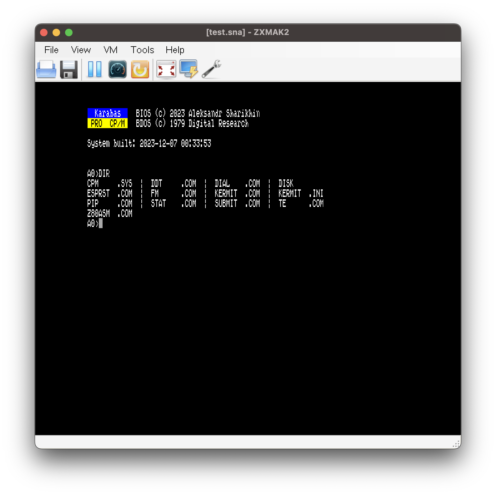

# CP/M 2.2 port for Karabas Pro

  

## About project

This repository contains vanilla CP/M 2.2 ported to Karabas Pro. 

It uses +3DOS volumes on Z-Controller SD card as CP/M's partitions.

**This software still in development and can be unstable!**

## SD Card layout

MMC card should have +3DOS volumes. Most important things are - SD card should have up to 11 volumes named:
 * `CPM.A`(case sensitive - important create them in uppercase, 8 megs size - cause CP/M 2.2 limitations)
 * `CPM.B`(similar)
 * `CPM.C`
 * .....

 Only `CPM.A` volume is mandatory but it's really easier to use with more than one drive

## Development

More information will be added later. Almost all information about [ZXUno's port](https://github.com/nihirash/cpm-uno) are acceptable for this port now.

### Prerequirements
 
 - GNU Make
 - [sjasmplus](https://github.com/z00m128/sjasmplus) assembler(used for everything)
 - [zx7b](https://github.com/antoniovillena/zx7b) packer

### Building

Open `system` directory and call `make` utility - it will build `page3.bin` and `page7.bin` files, pack them with zx7 packer and after it - you'll got `cpm.$c` hobeta that contains all system with loader.

I'm using sjasmplus assembler for development tasks and ZXMak2 emulator.

## Terminal

Currently, implemented ADM-3 compatible terminal(like KayPro) with some extensions.

## TODO

 - [x] Support UARTs
 - [x] Rewrite partition management
 - [ ] General stabilization and testing
 - [ ] Write documentation
 - [ ] Acquire real Karabas Pro for testing :-)
 - [ ] SD card prepare utility
 - [ ] Support ProfiIDE interface
 - [ ] Support floppy drives?!

## License

CP/M port licensed with [Nihirash's Coffeware License](LICENSE).

It isn't hard to respect it.

Happy hacking!